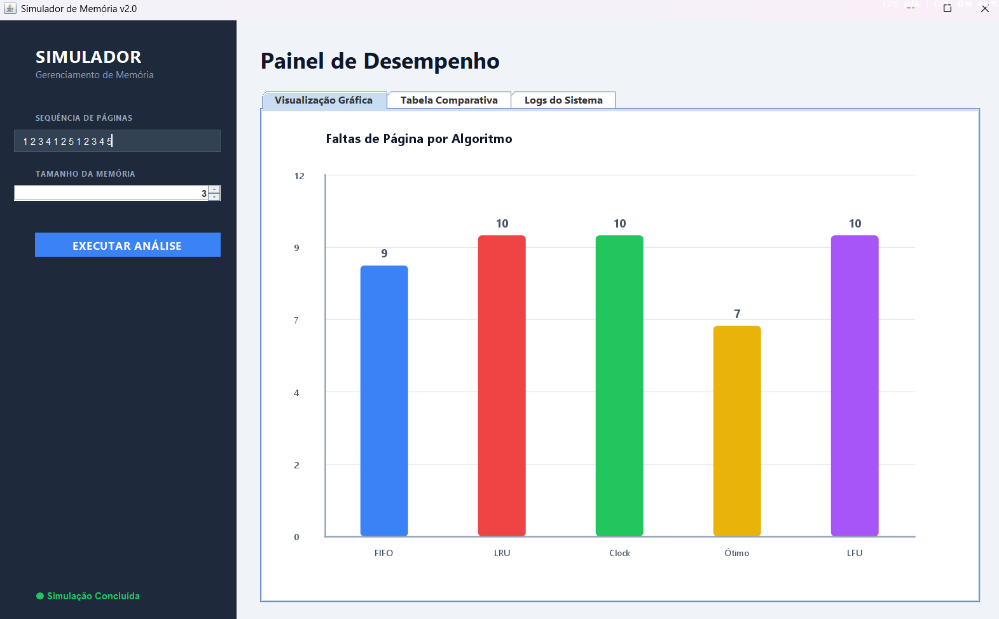

# RELATÓRIO DE ATIVIDADE - SUBSTITUIÇÃO DE PÁGINAS

## 👤 Identificação
**Disciplina**: Sistemas Operacionais  
**Aluno(a)**: [João Victor Lira Saraiva Leão]  
**Matrícula**: [2320445]  
**Data**: 07/05/2026

---

## 1. Introdução e Objetivos
Este relatório apresenta os resultados obtidos através do simulador de gerenciamento de memória virtual. O objetivo foi analisar o desempenho de diferentes algoritmos de substituição de páginas (FIFO, LRU, Clock, Ótimo e LFU) sob as mesmas condições de estresse de memória.

---

## 2. Metodologia (Algoritmos)
Foram implementados cinco algoritmos distintos:
*   **FIFO**: Substituição baseada na ordem de chegada.
*   **LRU**: Substituição baseada no tempo desde o último uso.
*   **Clock**: Algoritmo de segunda chance com ponteiro circular.
*   **Ótimo**: Referência teórica baseada no uso futuro.
*   **LFU**: Substituição baseada na frequência de acessos.

---

## 3. Resultados Obtidos
Configuração do Teste:
*   **Sequência de Páginas**: 1, 2, 3, 4, 1, 2, 5, 1, 2, 3, 4, 5
*   **Frames de Memória**: 3

| Algoritmo | Faltas de Página | Eficiência Relativa |
|-----------|-----------------|---------------------|
| **Ótimo** | **7**           | **100% (Benchmark)**|
| FIFO      | 9               | 77.8%               |
| LRU       | 10              | 70.0%               |
| Clock     | 10              | 70.0%               |
| LFU       | 10              | 70.0%               |

**Análise**: Como esperado, o algoritmo **Ótimo** obteve o melhor desempenho. O **FIFO** apresentou um resultado superior ao LRU nesta sequência específica, o que demonstra que a eficiência pode variar drasticamente dependendo do padrão de acesso às páginas.

---

## 4. Captura de Tela (Interface Gráfica)

> **[INSERIR AQUI O PRINT DA TELA DO SEU PROGRAMA]**  
> 

---

## 5. Conclusão
O simulador cumpriu seu papel educacional, permitindo visualizar que não existe um "melhor algoritmo absoluto" para todos os casos (exceto o Ótimo, que é impraticável). A interface gráfica moderna facilitou a percepção das nuances entre os métodos através dos gráficos de barras.

---

## 🔗 Referências e Código Fonte
*   **Código Fonte**: Disponível nos arquivos `Simulador.java`, `Interface.java`, `Grafico.java` e `Main.java`.
*   **README Completo**: https://github.com/JoaoVictorSL1/Gerenciamento-de-Memoria---Unifor
